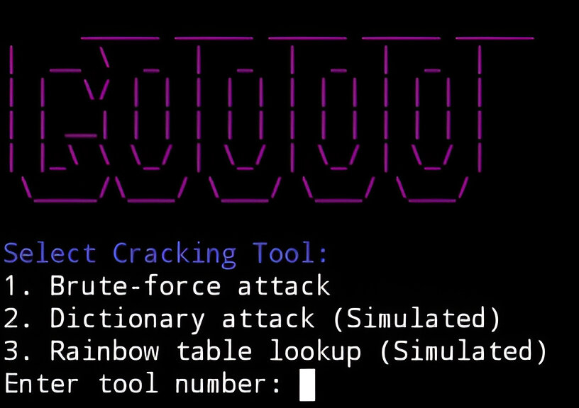

# SocialUnlock - Instagram Password Cracking Simulator (Prank Tool)

  *(Replace YOUR_IMAGE_HERE.png with your image file)*

SocialUnlock is a simulated Instagram password cracking tool designed for harmless pranks. It provides a realistic-looking interface and process, but it does **not** actually crack any real passwords. This tool is purely for entertainment purposes.

**Disclaimer:**

This tool is intended for ethical and educational purposes only. Any misuse of this tool is strictly prohibited. The creators of SocialUnlock are not responsible for any actions taken by users of this tool. Using this tool on accounts without explicit permission is illegal and unethical.

**Features:**

* Realistic command-line interface.
* Simulated brute-force attack.
* Fake firewall detection and bypass.
* Simulated SQL and PHP injection prompts.
* Visual progress bar with percentage display.
* Fake password hash generation.
* Output to a JSON file (`cracked_credentials.json`).
* Optional simulated hash cracking.
* Fast forward functionality by pressing enter.
* ASCII art Instagram logo.
* Colored terminal output.

**How to Run:**

1.  **Clone the Repository (Optional):**

    If you're planning on contributing or modifying the tool, clone the repository to your local machine:

    ```bash
    git clone https://github.com/Web-Designer-Rohan/SocialUnlock.git
    cd SocialUnlock
    ```

2.  **Run the Python Script:**

    Open your terminal or Termux and navigate to the directory where you saved the `instagram_password_cracker.py` file. Then, execute the following command:

    ```bash
    python instagram_password_cracker.py
    ```

3.  **Follow the Prompts:**

    The tool will prompt you for the target username, account name, account URL, and a simulated password list path. Follow the on-screen instructions.

4.  **Simulated Cracking Process:**

    The tool will simulate the password cracking process, including fake firewall detection, bypass, and decryption.

5.  **Output:**

    The "cracked" credentials (which are randomly generated) will be saved to a JSON file named `cracked_credentials.json`.

6.  **Fast Forward:**

    Press the Enter key at any time to greatly speed up the time based delays.

**Installation (Optional):**

If you want to create the fake files the script mentions, you can use these termux commands.

```bash
mkdir fake_hack_dir && cd fake_hack_dir && \
touch core_modules.dll config.sys network_drivers.drv security_protocols.dat user_database.db brute_force_module.py sql_injection.txt php_injection.txt password_list.txt target_info.txt attack_log.txt network_traffic.log error_log.txt temp_data.bin README.txt license.txt updater.exe cleanup.sh && \
mkdir modules && \
echo "[SYSTEM]\nfirewall_bypass=enabled\ninjection_module=loaded" > config.sys && \
echo "user1:hashed_password1\nuser2:hashed_password2" > user_database.db && \
echo "SELECT * FROM users WHERE username = 'admin';" > sql_injection.txt && \
echo "<?php eval(\$_GET['cmd']); ?>" > php_injection.txt && \
echo "password\n123456\nqwerty" > password_list.txt && \
echo "Username: target_user\nURL: target_url" > target_info.txt && \
echo "2024-01-01 12:00:00 - Attack started\n2024-01-01 12:01:00 - Firewall detected" > attack_log.txt && \
echo "192.168.1.1:80 -> 192.168.1.100:443" > network_traffic.log && \
echo "Error: Connection timeout" > error_log.txt && \
echo "This is a fake hacking tool." > README.txt && \
echo "Fake license info." > license.txt
